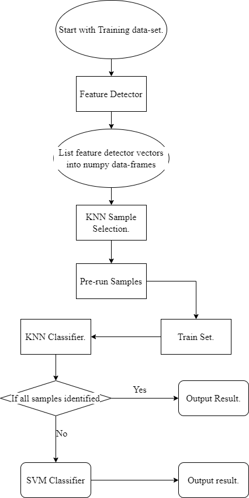
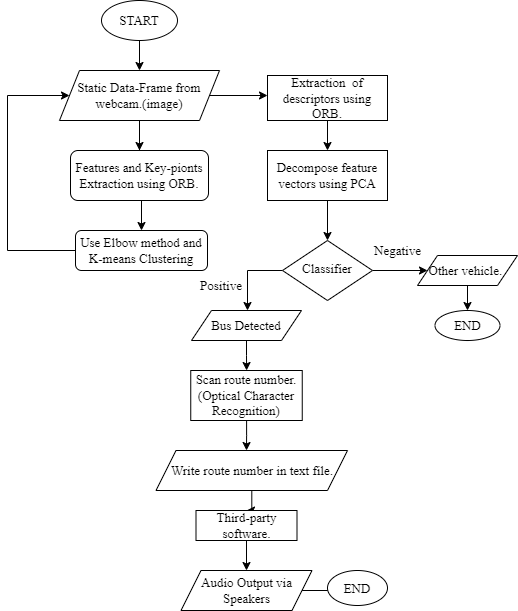

<h1 align="center">Bus-Route-Detection-and-Classification</h1>

<div align="center">
 
[![Contributors][contributors-shield]][contributors-url]
[![Forks][forks-shield]][forks-url]
[![Stargazers][stars-shield]][stars-url]
[![Issues][issues-shield]][issues-url]
[![CC0 v1.0 License][license-shield]][license-url]
[![LinkedIn][linkedin-shield]][linkedin-url]
<!-- [![Webpage][web]][web-url] -->
 
 </div>
 


  <p align="center">
    Bus Route Detector and Classifier for Visually Impaired People
    <br />
    <a href="https://github.com/DrCybernotix/Bus-Route-Detection-and-Classification/blob/main/README.md"><strong>Explore the docs »</strong></a>
    <br />
    <br />
    <a href="https://github.com/DrCybernotix/Bus-Route-Detection-and-Classification/blob/main/README.md">View Demo</a>
    ·
    <a href="https://github.com/DrCybernotix/Bus-Route-Detection-and-Classification/issues">Report Bug</a>
    ·
    <a href="https://github.com/DrCybernotix/Bus-Route-Detection-and-Classification/issues">Request Feature</a>
  </p>

 
 <div align="justify">
 <!-- TABLE OF CONTENTS -->
<details>
  <summary>Table of Contents</summary>
  <ol>
    <li>
      <a href="#about-the-project">About The Project :</a>
      <ul>
        <li><a href="#built-with">Built With</a></li>
      </ul>
    </li>
    <li>
      <a href="#getting-started">Getting Started</a>
      <ul>
        <li><a href="#prerequisites">Prerequisites</a></li>
        <li><a href="#installation">Installation</a></li>
      </ul>
    </li>
    <li><a href="#usage">Usage</a></li>
    <li><a href="#roadmap">Roadmap</a></li>
    <li><a href="#contributing">Contributing</a></li>
    <li><a href="#license">License</a></li>
    <li><a href="#contact">Contact</a></li>
  </ol>
</details>
 
 ## About the Project :
 
 Real-time object recognition and classification of objects through static data-frames is implemented in this work. This is a promising sector to implement innovative ideas
 related to computer vision applications. Visually impaired individuals undergo through difficult situations and complications faced while recognizing visual information as well
 as processing that information in a state of chaos, like a crowded area such as bus stop. Things get even harder for them when there is a need to step up and examine whether
 the bus or any transport they want to board into, mainly public transports, are actually routing from their boarding destination towards their target destination.
 The chaotic situation makes it almost impossible for any blind person to summarize that information and board onto that transport medium correctly. There are hardly any aids
 for the visually impaired people that will actually help them classify between buses specifically. The idea of personal help can be held under consideration but that is not 
 always liable and viable. This paper describes a novel approach for recognizing buses and providing the corresponding routes.  The bus images are captured in real-time, then 
 the token number is extracted and the user is informed about the route information. 
 
## Getting Started

 This project can be setup locally by cloning the repo and installing the requirements.

### Prerequisites

This is an example of how to list things you need to use the software and how to install them.
 
 <br>
pip 
 ```sh
  python -m pip install --upgrade pip
 ```
opencv-python
```sh
pip install opencv-python
```
Dependencies 
 ```sh
pip install -r requirements.txt
```
 
 ## Flow of Implementation 
 
 <div align="center">
  
The project proposes the following flow for implementation of this idea : 
 
<a href="https://github.com/DrCybernotix/Bus-Route-Detection-and-Classification/blob/main/DemoImages/Picture1.png">
    
</a>

 Following is the flowchart for the back-end process which has been implemented :
 
<a href="https://github.com/DrCybernotix/Bus-Route-Detection-and-Classification/blob/main/DemoImages/Picture2.png">
    
</a>
  
</div>
 
 ## Optical Character Recognition : 
 
 After the classification of buses we implemented EasyOCR for reading the token numbers any other alternate Optical Character Recognition algorithm can be used here but it is advised to go for EasyOCR as it is easier to implement and gives almost 100% accuracy in character recognition.


The algorithm for the easy OCR is as follows : 

 Input: Bus image with route number pasted on it.
 Output: Recognised text that is number from the image

Stages of Initialization:

   * Start 
   * Convert RGB image to Grey image
   * Apply bilateral filter for noise reduction
   * Apply canny filter for edge detection 
   * Finding contours
   * Apply Masking
   * Extracting text from the masked image using easy OCR
   * Running if-else statement to find bus route
   * End
 
 ## Results 
 
 The following implementation with TensorFlow yeilded **98.6%** Accuracy on classification of Buses from non-Bus vehicles and **99.99%** Accuracy in Optical Character Recognition.
 
 ## License

Distributed under the CC0 License. See `LICENSE.txt` for more information.
 
 ## Contact

Twitter/Email - [@DrCybernotix](https://twitter.com/DrCybernotix) - 12shreyashh@gmail.com

Project Link: [Bus-Route-Detection-and-Classification](https://github.com/DrCybernotix/Bus-Route-Detection-and-Classification)
 
 </div>
 
[contributors-shield]: https://img.shields.io/github/contributors/DrCybernotix/Bus-Route-Detection-and-Classification.svg?style=for-the-badge
[contributors-url]: https://github.com/DrCybernotix/Bus-Route-Detection-and-Classification/graphs/contributors
[forks-shield]: https://img.shields.io/github/forks/DrCybernotix/Bus-Route-Detection-and-Classification.svg?style=for-the-badge
[forks-url]: https://github.com/DrCybernotix/Bus-Route-Detection-and-Classification/network/members
[stars-shield]: https://img.shields.io/github/stars/DrCybernotix/Bus-Route-Detection-and-Classification.svg?style=for-the-badge
[stars-url]: https://github.com/DrCybernotix/Bus-Route-Detection-and-Classification/stargazers
[issues-shield]: https://img.shields.io/github/issues/DrCybernotix/Bus-Route-Detection-and-Classification?style=for-the-badge
[issues-url]: https://github.com/DrCybernotix/Bus-Route-Detection-and-Classification/issues
[license-shield]: https://img.shields.io/github/license/DrCybernotix/Bus-Route-Detection-and-Classification.svg?style=for-the-badge
[license-url]: https://github.com/DrCybernotix/Bus-Route-Detection-and-Classification/blob/main/LICENSE
[linkedin-shield]: https://img.shields.io/badge/-LinkedIn-black.svg?style=for-the-badge&logo=linkedin&colorB=555
[linkedin-url]: https://in.linkedin.com/in/shreyash-bhatkar-5bb904194
[product-screenshot]: images/screenshot.png
<!-- [web]: https://img.shields.io/website?down_color=red&down_message=offline&style=for-the-badge&up_color=blue&up_message=Click%20for%20Live%20Demo&url=https%3A%2F%2Feskimoio.netlify.app%2Findex.html
[web-url]: https://eskimoio.netlify.app/ -->
